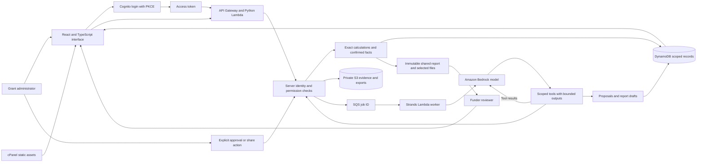

# GrantThread architecture

This diagram describes the intended AWS deployment and the local implementation boundary. It is not evidence that an AWS stack or a model run has been deployed. Record actual verification in [EVALUATION.md](EVALUATION.md).

The reconciliation model can choose and call seven tools to inspect authorised evidence, calculate allocations and propose work. Bank extraction uses a separate job kind and one structured extraction schema, with only the target statement's pages as model input. Tool events and saved results are inspectable; hidden reasoning is not shown. Neither agent can confirm financial entries, change permissions, pay money, publish reports or apply allocations. Those actions, where supported, require separate authenticated API requests.

## Local mode

Run `python -m grantthread.local_server` from `backend/`. Vite proxies `/api` to `http://127.0.0.1:8000`; the API shares the domain layer used by Lambda. SQLite holds scoped aggregates locally and local storage holds uploaded bytes. The demo login endpoint establishes a server-validated synthetic identity, but anyone accessing the demo can select any of its accounts. It is for fictional local testing, not an internet authentication service or a restricted store for sensitive financial files.

Local process execution does not establish SQS durability or cloud identity correctness. Without a configured Bedrock model, jobs must report unavailability and the deterministic workflow remains usable. This is not a successful agent demonstration.

## Data boundaries

- Original expense amount and currency are separate from allocations, paid status and required evidence.
- Financial entries preserve source currency and amount separately from the grant's reporting currency and confirmed conversion snapshot. Currency totals remain in separate buckets.
- Proposals retain input versions. Applying a stale proposal requires recomputation.
- Confirmed facts, calculated values, raw evidence and model suggestions remain distinct.
- A report draft is tied to fact versions. Sharing creates a recipient-specific snapshot with explicitly selected attachments.
- Funder APIs return the shared projection. They must not serialize the grantee's complete internal record.
- The repository's organisation aggregate makes the demo simpler to transact, but it is not a scale-tested storage design. Large organisations would require measured partition and contention work.

## Financial imports and confirmation

`finance_io.py` parses bounded XLSX workbooks and supported text-bank layouts without persistence or model calls. Original files and extracted PDF pages go to private storage; the organisation aggregate retains file keys, hashes, versions, preview rows and review status. Unknown bank layouts become `needs_ai`. Workbook formulas are never evaluated on the server: mapped transaction formulas need cached values saved by Excel.

`finance_service.py` authorises imports, produces editable drafts and confirms batches atomically against expected versions. Credits start unclassified. Bank payment matches update paid status on an existing expense without another expense allocation. Confirmed entries are immutable; linked signed adjustments use the original rate and cumulative rounding. `finance_math.py` stores money in integer minor units and normalises rates to at most 18 decimal places using decimal arithmetic. Matching receipts dated on or before the entry provide either a selected rate or a source-amount-weighted rate. Receipt balances are not consumed, and the financial confirmation flow does not enforce FIFO or grant/receipt spending caps.

Receipt mode without an explicit receipt ID automatically selects the latest eligible receipt marked `useAsDefault`, within the same grant and currency pair and dated on or before the entry. An explicit receipt ID overrides that selection. The receipt form opts in by default; API omission remains false. Adding an eligible receipt increments affected automatic/weighted draft versions, preventing stale confirmation of a changed conversion basis. Confirmed snapshots remain fixed.

Financial report projections select an inclusive reporting period, sum confirmed expenses and adjustments by category and show budget variance, unresolved work and source warnings. Standard XLSX exports include report, ledger and funding-receipt sheets. Template exports write only mapped cells; a mapped exchange-rate cell requires a single distinct foreign conversion rate among the report entries. Existing unmapped formulas remain formulas and may need Excel recalculation. See [FINANCIALS.md](FINANCIALS.md) for the user workflow and limits.

## Bank agent lifecycle

`worker.py` dispatches `bank_statement` jobs to `bank_agent.py` before reconciliation claims. Each persisted job fixes the authenticated actor, organisation, grant, import version and fact version. Claim tokens and expiring leases fence late or duplicate workers. Current same-import jobs are reused; stale inputs or expired leases allow a fresh job. Each actor has a bounded active run and daily run count. A successful upload remains stored if scheduling returns a quota/concurrency warning.

The bank agent uses genuine Strands/Bedrock structured output with at most two model/provider requests, 4,000 output tokens per call and a 180-second job limit. It checks exact source excerpts, dates, amount tokens, currency and debit/credit claims before saving up to 60 preview rows. Independently quoted totals or balances are checked when available; incomplete extraction and mismatches remain visible warnings. Source text cannot grant tool access or select another document. Successful extraction changes only the versioned import preview and operational job fields; human confirmation is a later transaction.

## Deployment decisions

The web host serves compiled public assets; persistent workers are designed to run on AWS. API and agent worker share one Python domain layer. Bank-file imports and per-grant currency conversion are implemented. Direct bank-account feeds, market exchange-rate feeds, AgentCore, OCR and consolidation into one portfolio currency are outside this release. AWS deployment and live Bedrock inference remain unverified; cPanel alone is a static preview. Public demonstrations use fictional records only. Sensitive documents require a separately operated, access-controlled environment with validated retention and operational controls.

See [API_CONTRACT.md](API_CONTRACT.md), [PERMISSIONS.md](PERMISSIONS.md) and [DEPLOYMENT.md](DEPLOYMENT.md).
