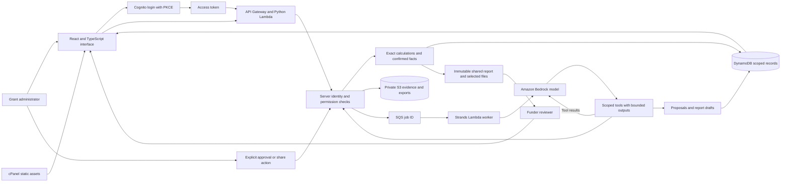

# GrantThread architecture

This diagram describes the intended AWS deployment and the local implementation boundary. It is not evidence that an AWS stack or a model run has been deployed. Record actual verification in [EVALUATION.md](EVALUATION.md).

The model can choose and call tools to inspect authorised evidence, calculate allocations and propose work. Tool events and saved results are inspectable; hidden reasoning is not shown. The model has no tool for changing permissions, paying money, publishing reports or applying allocations. Those actions, where supported, require separate authenticated API requests.

## Local mode

Run `python -m grantthread.local_server` from `backend/`. Vite proxies `/api` to `http://127.0.0.1:8000`; the API shares the domain layer used by Lambda. SQLite holds scoped aggregates locally and local storage holds uploaded bytes. The demo login endpoint establishes a server-validated synthetic identity. It is a local development convenience, not an internet authentication service.

Local process execution does not establish SQS durability or cloud identity correctness. Without a configured Bedrock model, jobs must report unavailability and the deterministic workflow remains usable. This is not a successful agent demonstration.

## Data boundaries

- Original expense amount and currency are separate from allocations, paid status and required evidence.
- Proposals retain input versions. Applying a stale proposal requires recomputation.
- Confirmed facts, calculated values, raw evidence and model suggestions remain distinct.
- A report draft is tied to fact versions. Sharing creates a recipient-specific snapshot with explicitly selected attachments.
- Funder APIs return the shared projection. They must not serialize the grantee's complete internal record.
- The repository's organisation aggregate makes the demo simpler to transact, but it is not a scale-tested storage design. Large organisations would require measured partition and contention work.

## Deployment decisions

The web host serves compiled public assets; persistent workers run on AWS. API and agent worker share one Python domain layer. AgentCore, OCR, bank integration and multi-currency consolidation are outside this release. Before real documents are considered, validate account region, model access, retention, operational controls and source extraction quality. The public demonstration uses synthetic records only.

See [API_CONTRACT.md](API_CONTRACT.md), [PERMISSIONS.md](PERMISSIONS.md) and [DEPLOYMENT.md](DEPLOYMENT.md).
